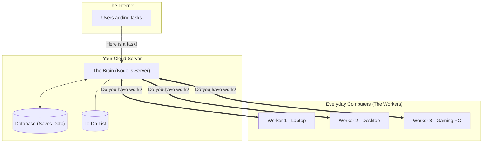
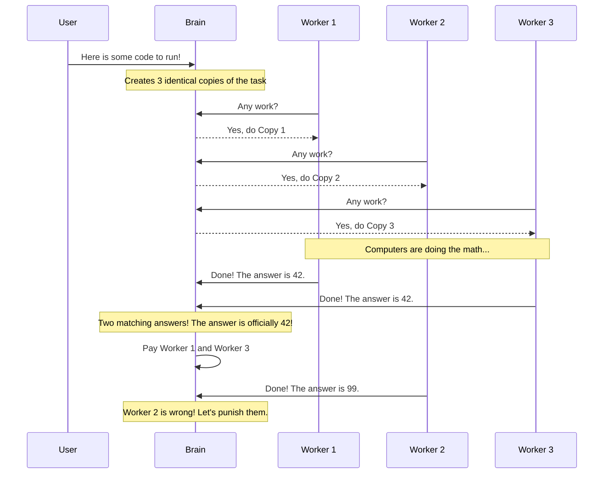

# ANTP: How it Works, Testing, and Getting it Online

This guide explains how the ANTP platform works in plain English without the jargon. It also shows you how to test it right now on your computer, and how you can eventually put it on the internet for real users.

---

## 1. How it Fits Together Visually

### A. The Big Picture

The system has three main parts that talk to each other:
1. **The Users:** People who want to run code or apps.
2. **The Brain (Orchestrator):** Your central server that takes requests and hands out work. 
3. **The Workers (Edge Daemons):** Everyday computers (like your laptop) that run the actual code in the background and send the results back.

Instead of the Brain manually pushing work to the Workers, the Workers constantly ask the Brain, *"Do you have any work for me?"* This makes the system extremely fast and prevents the server from getting overloaded.



### B. How a Task Gets Done

We don't just trust one computer to do the math correctly (in case it disconnects or lies). Here is what happens when someone sends a task:

1. **Splitting it up:** The Brain receives the task and creates 3 identical copies.
2. **Getting Assigned:** Three different Worker computers separately ask for work, and each takes a copy.
3. **Double Checking:** The 3 computers calculate the result and send it back to the Brain.
4. **Approval:** The Brain checks if at least 2 out of the 3 computers got the exact same answer. If they match, the task is marked Complete, and those computers are paid! The computer that got it wrong (or disconnected) loses points.



---

## 2. How to Test It Right Now

Since you already have the server and the app running in your terminal, you can send test commands through a new terminal window to watch the system react in real-time!

**Test 1: Check if the server is healthy**  
This tells you how long the server has been running and how many worker computers are connected.
```bash
curl -s http://localhost:8080/api/health | python3 -m json.tool
```

**Test 2: Check overall stats**  
This shows you the database layout and if any tasks are waiting in the queue.
```bash
curl -s http://localhost:8080/api/system/stats | python3 -m json.tool
```

**Test 3: Send a Fake Task** *(The fun part!)*  
This command acts like a user demanding compute power. Paste this into your terminal:
```bash
curl -X POST http://localhost:8080/api/task \
  -H "Content-Type: application/json" \
  -d '{
    "wasmBytes": [0,97,115,109,1,0,0,0], 
    "input": [1,2,3], 
    "timeoutMs": 5000, 
    "tier": "TIER_1"
  }'
```
*What happens next: Watch your other terminal windows! The Brain will immediately receive this, and your background worker app will steal the task and try to run it!*

---

## 3. How to Launch It Online (AWS & App Installers)

Right now, everything only works on your own laptop. To make it a real company, you need to put it on the public internet.

### A. The Database (Already Done!)
Good news! Your Neon.tech database is already in the cloud, so you don't need to do anything. Just ensure your `DATABASE_URL` is kept a secret!

### B. Deploying the Brain to Render.com (Free Tier)
If AWS is giving you trouble, you can easily use **Render.com** to host your server for free! Render is incredibly popular because it pulls the code directly from your GitHub repo and deploys it automatically.

> **⚠️ Free Tier Limitation:** Render's free tier works perfectly with our WebSockets, but it will "go to sleep" if no one connects to it for 15 minutes. When it is asleep, the first Worker trying to connect might take up to 30-50 seconds to wake the server up. For a production startup, you'd eventually upgrade to a $7/month paid tier so it never sleeps.

**Step-by-Step for Render:**
1. **GitHub Upload:** Push your entire ANTP workspace code to a public or private GitHub repository.
2. **Create a Web Service:** Go to [Render.com](https://render.com), log in with GitHub, click "New", and select "Web Service".
3. **Connect Your Repo:** Choose the GitHub repository you just uploaded.
4. **Configure Settings:**
   - **Language:** `Node`
   - **Build Command:** `cd orchestrator && npm install`
   - **Start Command:** `cd orchestrator && npx tsx src/index.ts`
5. **Add Environment Variables:** Scroll down to the Environment Variables section and add the required secure keys from your `.env.local` file:
   - `DATABASE_URL` (Your Neon string)
   - `JWT_SECRET`
   - `NODE_AUTH_SECRET`
6. **Deploy:** Click "Create Web Service". Render will automatically build the code and issue you a live public URL (like `https://antp-brain.onrender.com`).
*Congratulations, your Brain is officially alive on the internet! You can test it by going to `https://antp-brain.onrender.com/api/health`.*

### C. Creating the Worker App (.dmg and .exe)
You don't want everyday users to have to use terminal commands to become a Worker. Using our Tauri framework, you can pack your complex Rust code into standard double-clickable installers!

**For Mac Users (.dmg):**
Tauri requires you to build Mac apps on a Mac machine.
1. Open your terminal and go to the edge-daemon folder:
   ```bash
   cd ANTP/edge-daemon
   ```
2. Run the Tauri bundle command:
   ```bash
   npm run tauri build
   ```
3. Wait 5-10 minutes. When it finishes compiling down to native machine code, your shiny new Mac installer will be sitting inside `src-tauri/target/release/bundle/dmg/`. You can upload this exact `.dmg` file to your website!

**For Windows PC Users (.exe):**
Tauri requires you to build Windows apps on a Windows machine. You cannot build a Windows `.exe` from your MacBook directly!
1. Log into a Windows computer (or set up a free automated "GitHub Actions" workflow that uses a Windows cloud-computer).
2. Install Node.js, Rust, and the C++ Build Tools on that Windows machine.
3. Open PowerShell, navigate to your `/ANTP/edge-daemon` folder, and run:
   ```powershell
   npm run tauri build
   ```
4. Tauri will compile everything and generate a classic Windows installer. It will be located in `src-tauri\target\release\bundle\nsis\`. You can now upload this `.exe` file alongside your `.dmg` file for PC users to download!

---

## 4. How to Scale It (Handle Millions of Users)

When you eventually have 100,000 computers connecting to your network at once, a single "Brain" server will crash from the traffic. You fix this in 3 easy steps:

1. **Multiple Brains:** Instead of running 1 Orchestrator server, you boot up 5 or 10 of them on AWS.
2. **Traffic Cop:** You put a system called a "Load Balancer" in front of your 10 Brains. When a Worker connects, the Load Balancer directs them to the Brain that is the least busy.
3. **Shared Memory:** Because you now have 10 separate Brains, if Brain #2 gets a task, Brain #5 won't know about it! You fix this by taking the "To-Do Queue" out of the individual servers and putting it into a shared "Redis" or "Kafka" server. This way, all 10 Brains use the exact same shared notepad to hand out tasks securely.
